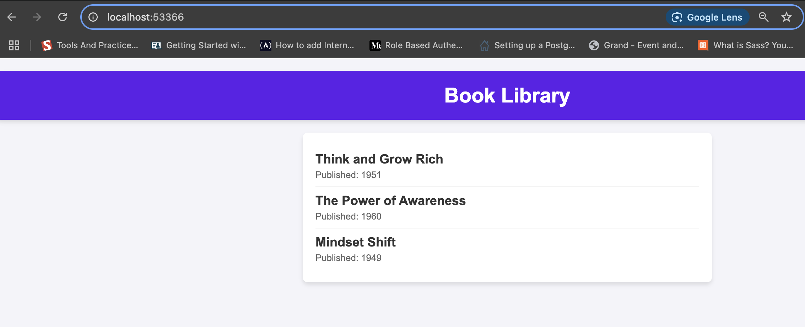

# React Library Application

This repository contains the code for the React Library Application. The app is containerized using Docker, deployed on Minikube, and has a CI/CD pipeline with GitHub Actions.

## 1. Build and Run Locally Using Docker

### Prerequisites:
- Docker installed on your machine.
- Kubernetes and Minikube installed.
- `kubectl` command-line tool installed.
- A GitHub account for accessing the repository.
- Basic knowledge of containerization and Kubernetes concepts.

### Steps:
1. Clone the repository:
   ```bash
   git clone https://github.com/DorcasToto/React-Library.git
   cd React-Library
   ```

2. Build the Docker image:
   ```bash
   docker build -t react-library:v1.0.0 .
   ```

3. Run the container:
   ```bash
   docker run -p 3030:80 react-library-app:v1.0.0
   ```

   Access the app at `http://localhost:3030`.

---

## 2. Deploy on Minikube

### Prerequisites:
- Docker installed on your machine.
- Kubernetes and Minikube installed.
- `kubectl` command-line tool installed.

### Steps:
1. Start Minikube:
   ```bash
   minikube start --driver=docker
   ```

2. Create the deployment and service files (`deployment.yaml` and `service.yaml`).

3. Apply the files:
   ```bash
   kubectl apply -f deployment.yaml
   kubectl apply -f service.yaml
   ```

4. Access the app:
   ```bash
   minikube service react-library-service --url
   ```

---

## 3. CI/CD Pipeline with GitHub Actions

### GitHub Actions Workflow:
- Automatically builds and pushes the Docker image to Docker Hub when a push is made to the `main` branch.

---

## Challenges & Assumptions

- **Assumptions**: Basic knowledge of Kubernetes, Docker, GitHub Actions.

## Screenshot of Application Results

[Docker Hub Screenshot](./dockerhub.png)  
  
 